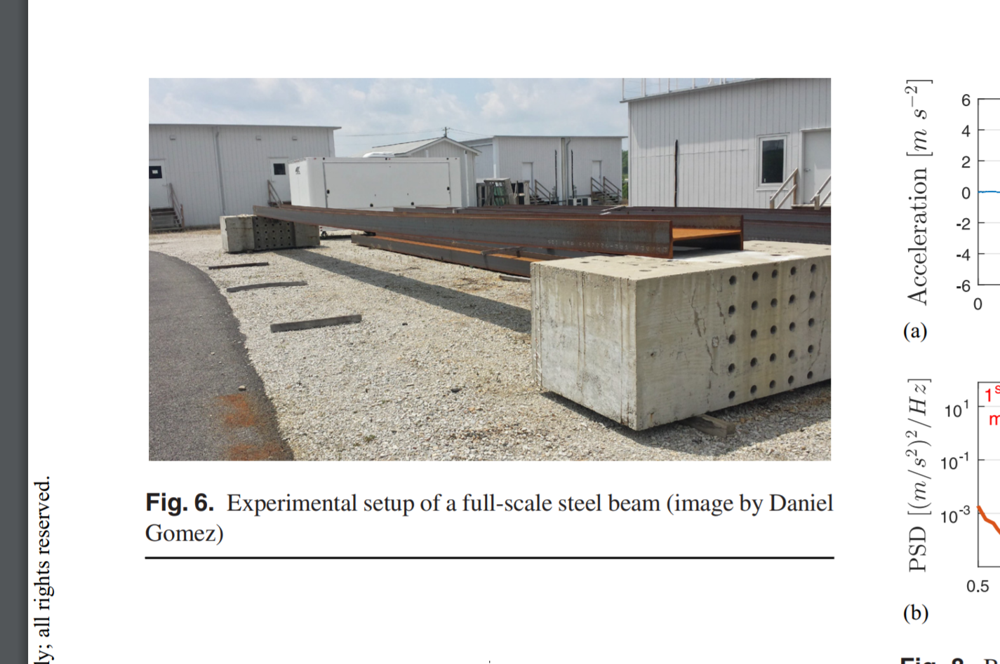

**2000**

https://www.telegraph.co.uk/news/uknews/1345480/Walking-in-step-made-bridge-wobble.html

Subsequent research showed that though the bridge is strong enough to carry the weight required, the designers had not asked the right questions about lateral movement because such problems had rarely been experienced before.

**2005**

https://www.sciencedaily.com/releases/2005/11/051103080801.htm

The problem, says Strogatz, was one of crowd dynamics as much as engineering. The bridge surpassed standards for withstanding weight and wind. Every nonhuman element had been tested.

Instead of focusing on the structure, Strogatz examines the strange phenomenon of people unknowingly working together, simply by walking.

The military has known for years that troops marching in step can create enough vertical force to destroy a bridge. It is standard practice for soldiers to break step at every bridge crossing.

"If the people are initially disorganized and random, if a few of them get into sync by accident, the bridge would become unstable," he says. With a certain critical number of pedestrians, the wobbling becomes marked enough to force everyone into stride -- thus compounding the problem.

**2017**
https://ascelibrary.org/doi/abs/10.1061/%28ASCE%29BE.1943-5592.0001204

**2018**
https://arstechnica.com/science/2018/10/new-study-sheds-more-light-on-what-caused-millennium-bridge-to-wobble/

This is a significantly improved model of how people adjust their gait when walking on a wobbly surface, according to co-author Varun Joshi of Ohio State University. It suggests that one might not even need synchronization to cause the shaking. 

It turns out that people walking on a bridge that starts to shift will instinctively adjust their stride to match the bridge's swaying motion as it lurches sideways. This will be familiar to anyone who has tried to walk on a fast-moving train and needed to find steady footing as the train wobbled from side to side. But on a bridge, this exacerbates the problem, giving rise to additional small sideways oscillations that amplify the swaying.

