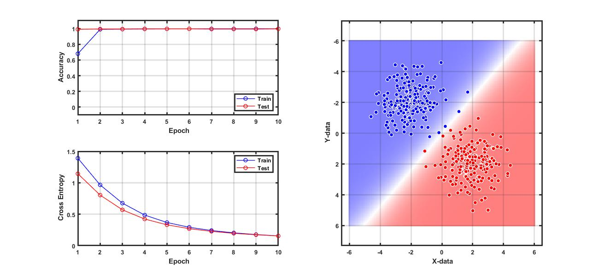
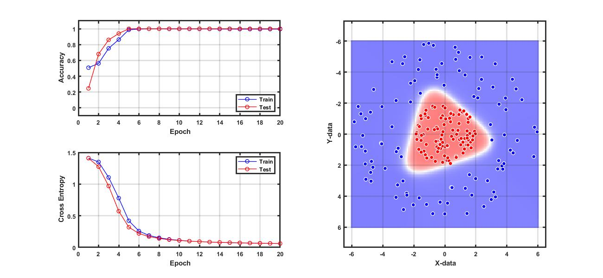
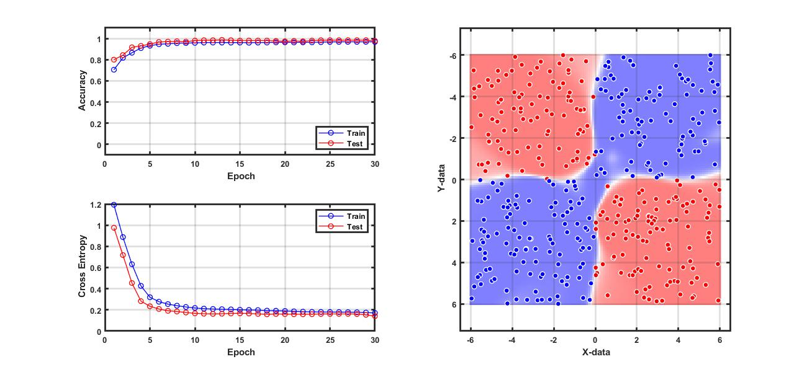
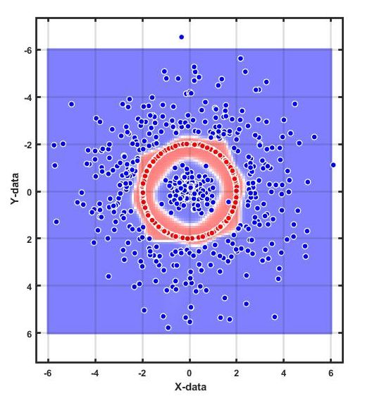

# Task8: Neural Network

**Announcement**: March 28, 2019    
**Due date**: April 10, 2019 (Wednesday) before 11:59 pm      

**NO MORE DELAY: Please submit your report earlier**   

In this task, I am giving you two problems that can be easily solved by only tuning the parameters (except Problem 1(a)). However, to better understanding the neural network, I recommend reviewing all codes in the folder and making an effort to learn how the codes work.  
    
## Problem 1 (60 points)
**(a)** Try out a neural network playground in this link: [http://playground.tensorflow.org](http://playground.tensorflow.org). Run all four examples by changing features, # of hidden layers, # of neurons, activation function, and/or learning rate (You do not need to include your results in your report). 

**(b)** Build a classifier using each of three datasets ('circle', 'gaussian', 'xor') in `nn_demo_run.m`. The accuracy of the classifier should be sufficiently high. You will finally obtain the figures like below: 

|Gaussian|Circle|Xor|
|:----:|:-----:|:----:|
||||

Note that you may need to change the parameters to obtain these results, such as learning rate, number of epoch, number of nodes in the hidden layer. 

**(c)** Create your own dataset and build a classifier. Please do not make the dataset similar to the above examples. Please be creative. 

## Problem 2 (40 points)
Please load `task8_problem2_data.mat`. There is two sets of data `(x_set1, y_set1)` and `(x_set2, y_set2)`. This problem is to build a classification model that can classify your new points into set1 and set2. Please use the code provided. You will need to obtain the figure like below:

(Extra) Solve (a) using different methods that you are aware of. You can use internal functions in Matlab or Python.     

## Submission of Your Work
* **YOU MUST INCLUDE YOUR RESULTING GRAPHS OR IMAGES INTO YOUR REPORT**
* You should turn in a report and codes to uw.task@gmail.com. When you send your email, please cc your email for future reference.  
* A subject of your email must be the format of "Task8_`Your name` _ `Degree` _ `ID`"
	* `Your name`: first five letter your first + last name. The first letter is uppercase and the rest of them are lowercase (i.g Chul Min Yeum -> Chulmi, Juan Park -> Juanp)   
	* `Degree`: pick your degree among BA, ME, MA, and PH (BA=Undergraduate, ME=MEng, MA=MASc, and PH=PhD)  
	* `ID`: your school ID
	* Please do not include any other text except this subject line.    
* For writing equations, I recommend the use of latex equations editors introduced in the Markdown tutorial and inserting equation links. However, I also accept for attaching an image of your handwritten equation (but not recommend). 
* Your report includes your answers and styled codes for questions in the problems.
* The formats of the folder and files are 
	* Folder name: Task8_`Your name` _ `Degree` _ `ID` (same with the subject of your email)  
	* File names: "Code_`Your name` _ `Degree` _ `ID`.m or .py" for codes and "Rept_`Your name` _ `Degree` _ `ID`.md and .pdf".   
* The report must be written with Markdown script (GFM) and all other formats like docx or pptx are not permitted. 
* You should also include a report in pdf that must be converted from your report in Markdown.
* Please review the general submission instruction in the course syllabus. 
* When you violate these submission guideline, your report will be returned and must be resubmitted. 
> For example, Juan Park is using MATLAB to complete the Task8. Juan needs to submit his report and codes to **uw.task@gmail.com** with an attachment of **Task8_Juanp_BA_000000.zip**. In the folder, there are at least three files: 
> * Code_Juanp_BA_000000.m
> * Rept_Juanp_BA_000000.md
> * Rept_Juanp_BA_000000.pdf
* You may need to include all figures used for writing your report. 

## Note
* Please post a question if you need to help understand the problem and/or tutorials. 
* You are permitted to discuss the task with your **colleagues**.   
* Your grade depends on the completeness and clarity of your work.  
* You should include clear and concise comments in your codes.  