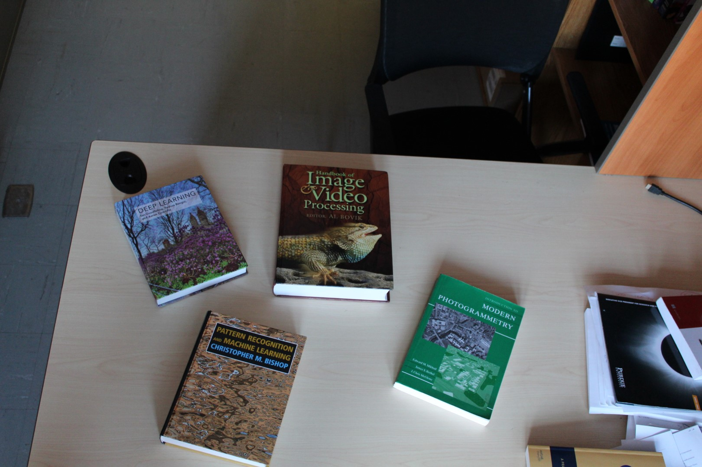
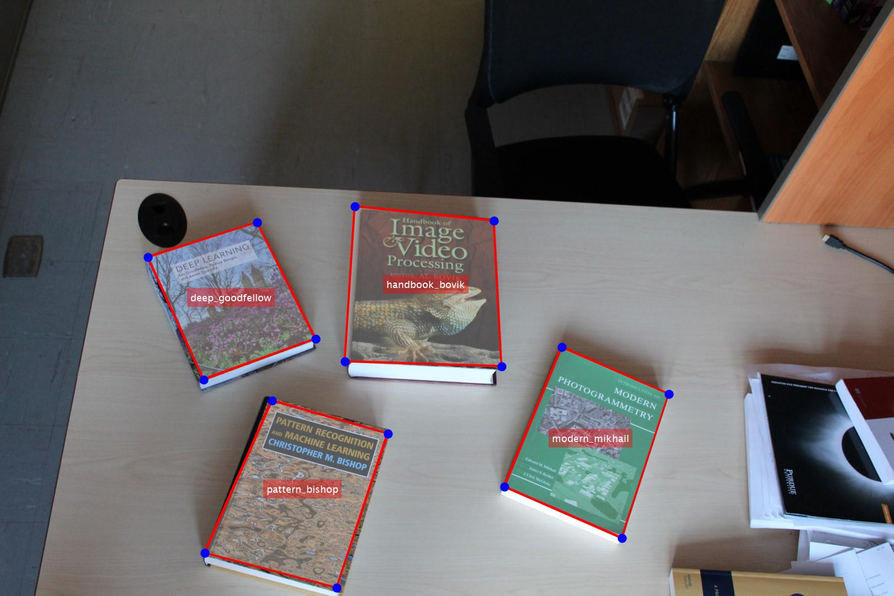
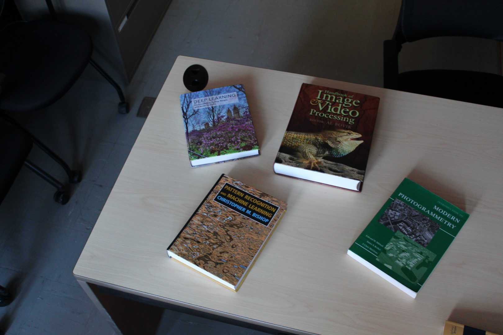
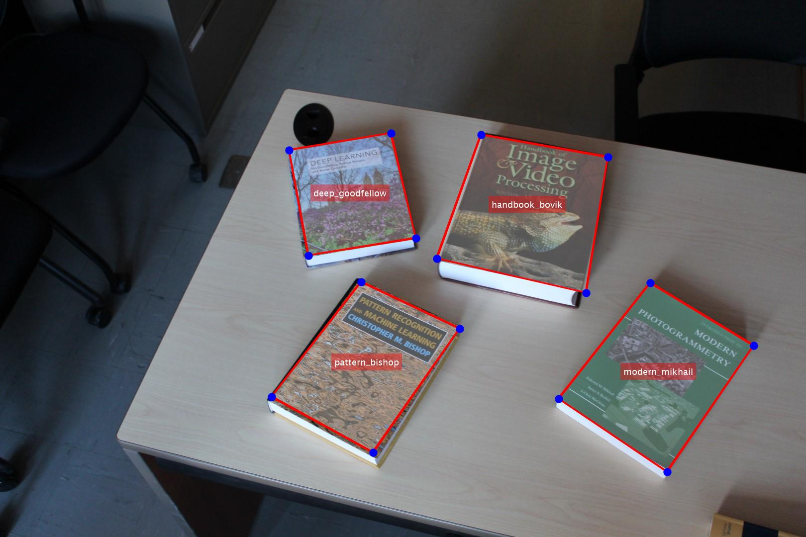
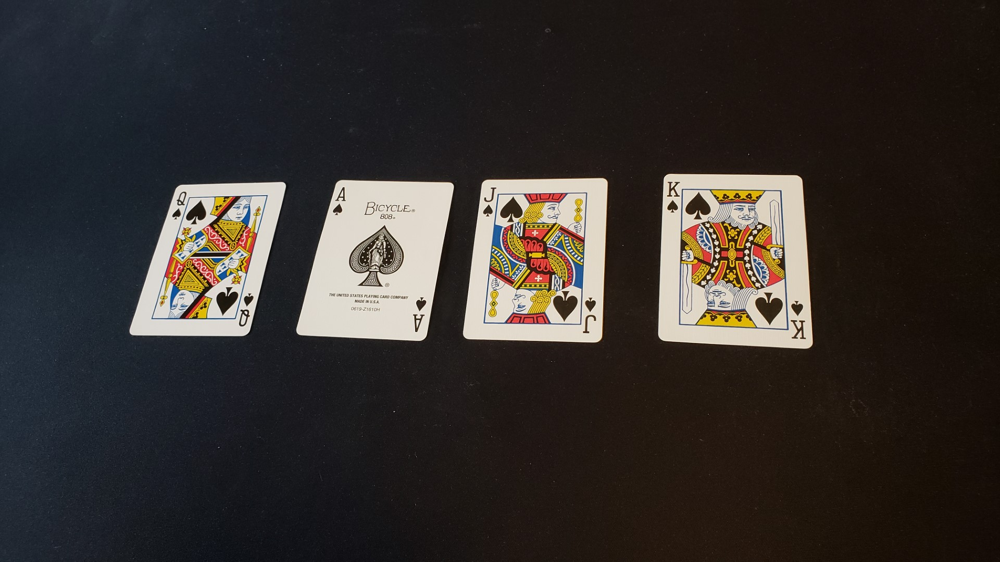
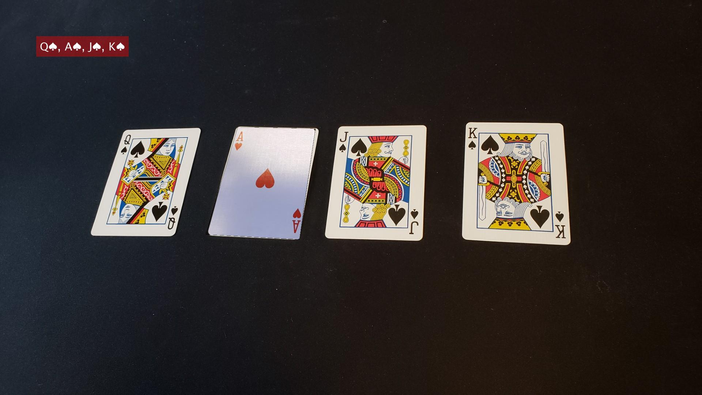
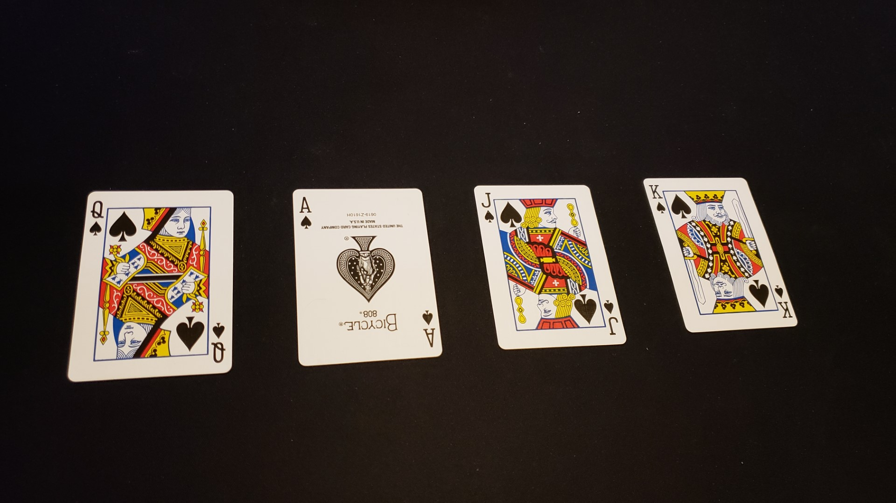
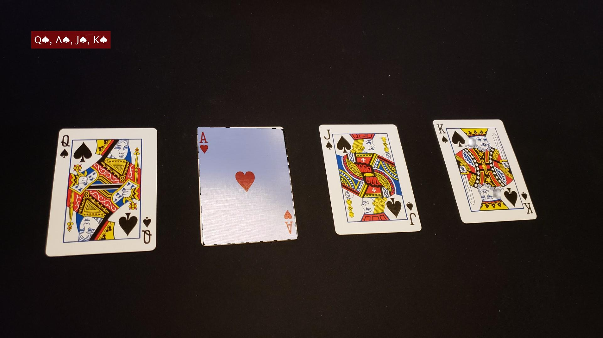

# Task07: Feature Matching & RANSAC

**Announcement**: March 14, 2021        
**1st due date**: April 02, 2021 before 11:59pm
**2nd due date**: April 09, 2021 before 11:59pm       

The main goal of this task is to understand the fundamental of a feature extraction and matching method (Scale-invariant feature transform (SIFT)) and a Random sample consensus (RANSAC) method to estimate model parameters. You must study the relevant tutorials to solve the corresponding problems. Please answer all sub-questions in each problem. You should write your own code to solve these questions *if needed*. 

* The quality of tools and results will be evaluated in this task. You need to draw points and lines on your results (similar to the samples provided).
* You must include all your results in the report.
* A total points in this task is 150 points.  

## Problem 1: LoG and DoG (10 points)
Please answer these questions **in detail**.

**(a)** What is the Laplacian of Gaussian (LoG)? When do we use LoG?   
**(b)** What is the Difference of Gaussian (DoG)? When do we use and why DoG is advantageous compared to LoG?   

## Problem 2: Least Squares (20 points)
**(a)** Explain the approach 1 and approach 2 for least-square line fitting in your words. Please refer to the course slide and tutorials. 

A response yi is measured from a linear system when an input is xi. The measurement data is provided (`prob2_data1.mat`). A model of your system can be approximated as yi = mxi + b. Please find m and b using the following methods. 

**(b)** Least squares (approach 1) 

**(c)** Least squares (approach 2)

Here is another measurement data (`prob2_data2.mat`). Please find m and b using the following methods. 

**(d)** Least squares (either approach 1 or approach 2)

**(e)** Use of RANSAC. You need to have your own RANSAC implementation without using existing functions in MATLAB or Python (must not use `ransac` or any other relevant functions)

**(f)** When do we use either least squares or RANSAC? What are the pros and cons of each technique? 

## Problem 3: Fitting using RANSAC (20 points)

**(a)** Fit an ellipse to the given data (`prob3_ellipse.mat`) using RANSAC

**(b)** Fit a fourth-degree polynomial to the given data (`prob3_polynomial.mat`) using RANSAC 

 

:star::star: **You need to install** [**vl_feat**](https://www.vlfeat.org/) **to solve the following problems 4, 5, and 6 for MATLAB users**  

:star::star: **For Python users, please install OpenCV to solve the following problems 4, 5, 6, and 7**  

Note that if you can solve problems 4, 5, 6, and 7 using Python, you will receive extra 10 points. 

## Problem 4: Improved 3D Planar Measurement Tool (20 points)
You are going to build an improved 3D planar measurement tool. This application is designed to measure a 3D distance on a plane **without picking the corners of the booklet in advance**. Users will take a photo on a planar surface where a calibrate paper (here, booklet) is placed and simply click two points on the image for measurement. This reduces the step for picking the corners of your calibration paper. Here is a demo video:

**(a)** Build your own measurement tool and evaluate your measurement using the images provided (see the folder of `prob4_img`). You may need to estimate homography based on SIFT feature matching. The exact size of the booklet is **24 cm x 31.5** cm and use `cover.jpg` to solve this problem.

**(b)** Prepare your own calibration paper and take photos similar to the ones in (a). Then, evaluate your tool. 

**(c)** Compare measurements using this new tool and the one developed in Task 3.  

Note that you **should not do hard cording**. This means the corner points of the booklet on your **test image** is completely unknown and must be detected or measured with your code.  

## Problem 5: Book Classification using SIFT (20 points)
You are going to categorize books on images. Here are the input images and expected outcomes. 

|Test image|Result|
|:----:|:-----:|
|||
|||

Your code needs to automatically compute the outlines (boundary) of each book and its identity (book name). There are 17 images (see the folder of `prob5_img`) and in each image, four books are placed on a desk. Your code should not fail to identify a book or estimate its boundary no more than 5 books among all books (85 = 17 images x 5 books). Note that you should not do hard cording. Note that this problem is not asking you to use edge detection! 

Hint: You can reuse the code that you are developing in Problem 4. Like `cover.jpg`, you need to prepare cover images and name them. Note this problem **cannot** be solved using Hough transform. 

Hint: You can download the book covers from the web. 

## Problem 6: Image Stitching (30 points)

First, go to an [**image stitching tutorial**](https://www.mathworks.com/help/vision/examples/feature-based-panoramic-image-stitching.html) and thoroughly review the code. You have to fully understand its process. 

Second, you are going to update this code. Your code must satisfy the following conditions:
* Do not use `imageDatastore` and related functions that call this object in MATLAB. 
* Use SIFT feature extractor and descriptor rather than `SURF`. You can use `vl_sift` for MATLAB and opencv for Python. 
* Do not use `estimateGeometricTransform` and replace it using your own homography estimator that you may developed in problem 4. You need to use RANSAC for robust matching. 
 
Third, test your code using the building dataset (the image set used in the tutorial) in MATLAB. For Python users, you can find those images `prob6_building_img.zip`.

Fourth, **take your own image set** (more than 3 images) from a scenic place and stitch them to create a nice panorama image. You **should not** download images on the web or use my images and should not share your images with your colleagues. Please take your images using your cameras. 

If your resulting panorama is not good quality, you need to explain what factors make dropping its quality. 

## Problem 7: Card Number Identification and Replacement (30 points)
You are going to recognize the card numbers and replace A♠ with A♥. Here are the input images and expected outcomes. 

|Test image|Result|
|:----:|:-----:|
|||
|||

Here is a demo video:

Your code needs to automatically compute a number of each card using the given card image in (`prob7_img/card`). The sequence of the card numbers on the given images (`prob7_img/img`) are marked on the top of the corresponding images (see the resulting image above). All cards are the same size. Next, I like ♥ better than ♠. Please replace (or overlay) the A♠ card with the A♥ card. The quality of the overlay is similar to the ones in the resulting images above. 

You should not do hard cording to find out the sequence and card overlay. Note that this problem is NOT edge detection or object recognition. You can solve it using the code that you made for the previous problems or tasks. 

## Submission of Your Work
* **YOU MUST INCLUDE YOUR RESULTING GRAPHS OR IMAGES INTO YOUR REPORT**
* You should turn in a report to uw.task@gmail.com. When you send your email, please cc your email for future reference.  
* A subject of your email must be the format of "Task07_`Your name` _ `Degree` _ `ID`"
	* `Your name`: first five lower-case letters your **first + last** name. It should be lower case. (i.g Chul Min Yeum -> chulmi, Juan Park -> juanp)   
	* `Degree`: pick your degree among BA, ME, MA, and PH (BA=Undergraduate, ME=MEng, MA=MASc, and PH=PhD)  
	* `ID`: your school ID
	* Please do not include any other text except this subject line.    
* Your report includes styled codes for all problems (please check the Markdown tutorial for code styling). 
* The report must be written with Markdown script (GFM) and all other formats like .docx or .pptx are not permitted. 
* You should also include a report in pdf that is converted from your report in Markdown.  
* In your submission folder, you should include a report in the format of both .pdf and .md in a folder. And, it should be zipped before attaching it to your email. 
* The formats of the folder and files are 
	* Folder name: Task07_`Your name` _ `Degree` _ `ID` (same with the subject of your email)  
	* File names: "Rept_`Your name` _ `Degree` _ `ID`.md and .pdf".   
* Please review the general submission instruction in the course syllabus. 
* When you violate these submission guidelines, your report may be returned. 

## Note
* Please post a question if you need to help understand the problem and/or tutorials. 
* You are permitted to discuss the task with your colleagues, but do not copy the solutions.     
* Your grade depends on the completeness and clarity of your work.  
* You should include clear and concise comments in your codes.  