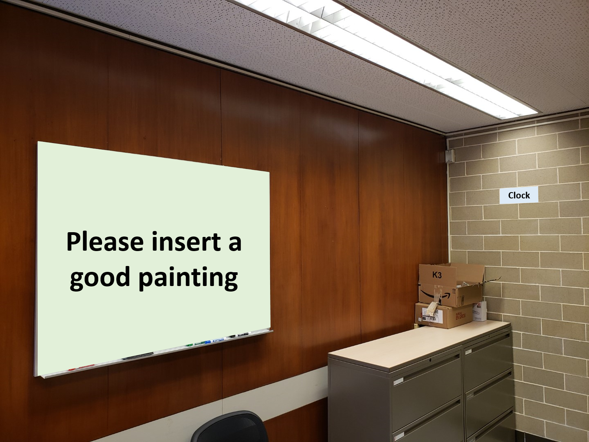
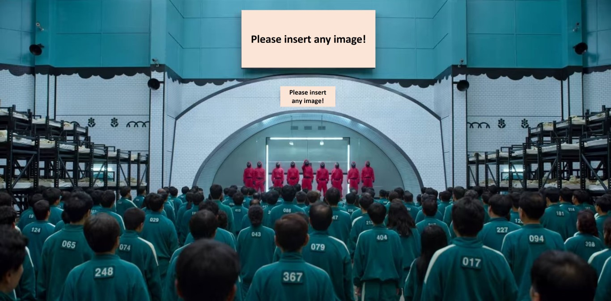
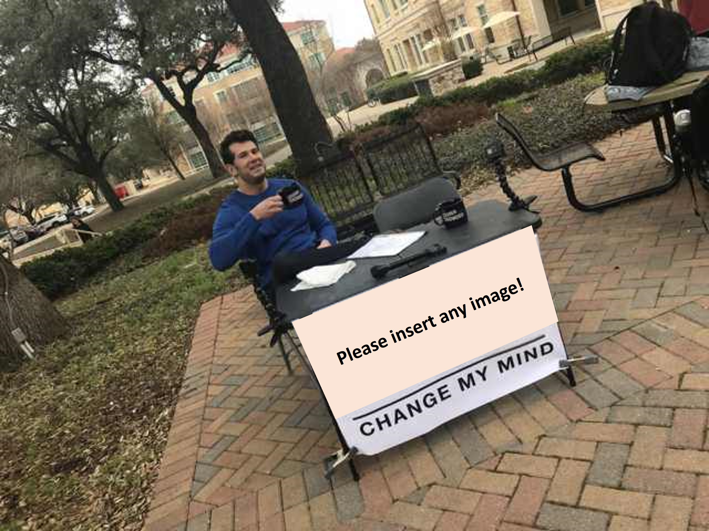
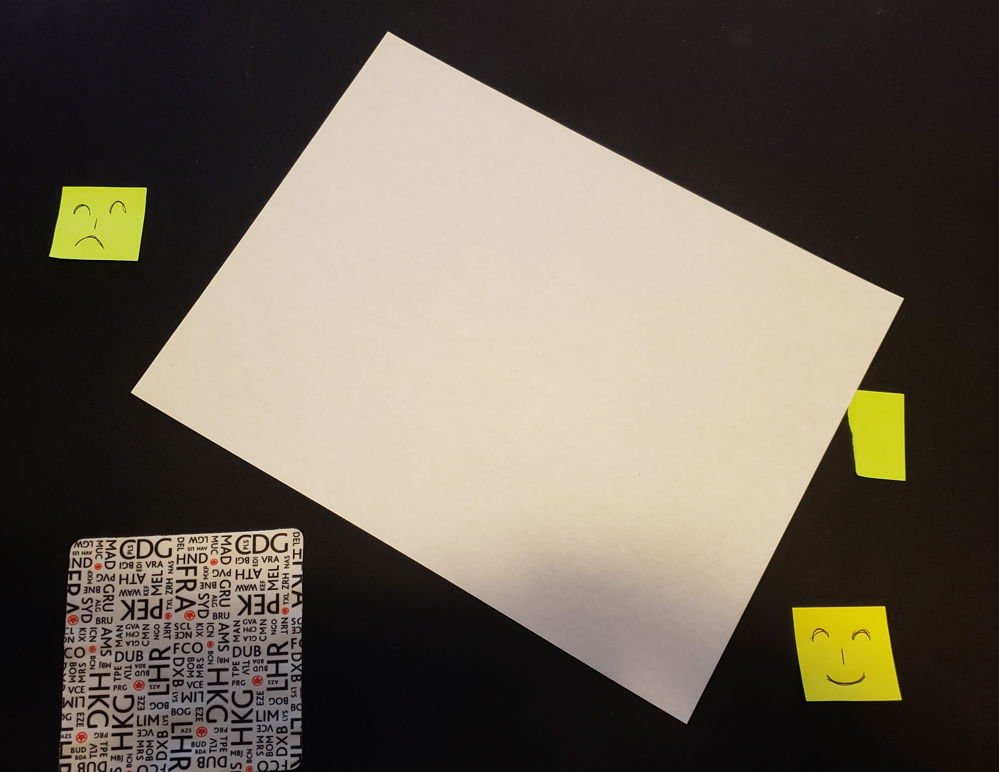
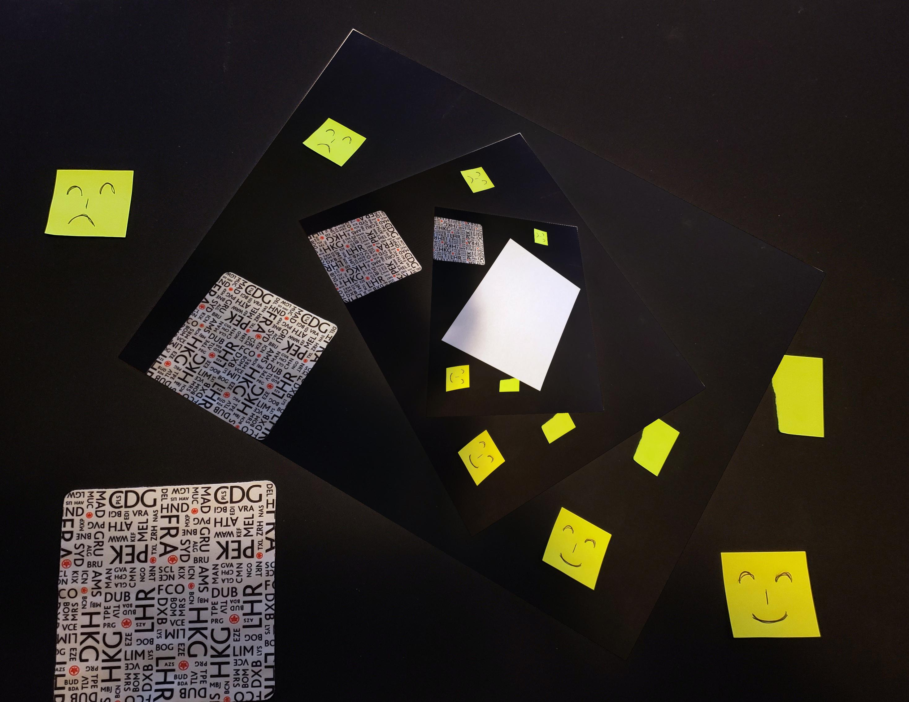

# Task05: Homography

**Announcement**: February 08, 2021        
**1st due date**: March 06, 2021 before 11:59pm
**2nd due date**: March 13, 2021 before 11:59pm        

The main goal of this task is to understand the fundamental of the homogeneous coordinate and the homography relationship between points on two images of the same planar surface in space. Please answer all sub-questions in each problem. You should write your own code to solve these questions. 

## Problem 1: Homogeneous Coordinate (Lines and Points) (10 points)
The intersection of two lines **l1** and **l2**, with **l1** passing through the points (8,4) and (1,7), and **l2** passing through the points (6,3) and (-3,8). 

**(a)** Compute the intersection without using homogeneous coordinates 

**(b)** Compute the intersection using homogeneous coordinates

## Problem 2: Homogeneous Coordinate (Lines) (10 points)

The four lines (**l1**, **l2**, **l3**, and **l4**) are intersected at six points. **Among the six points, please find four points that form a quadrangle with your code, not manually**. Please explain your own algorithm to pick these four points.

<!---
https://latex.codecogs.com/legacy/eqneditor/editor.php

\begin{matrix}
\\ l_1: y = 0.59756\cdot x + 921.94
\\ l_2: y = -1.935\cdot x  + 6050.3
\\ l_3: y = 0.51575\cdot x -495.56
\\ l_4: y = -1.3858\cdot x + 1685.5
\end{matrix}
-->

## Problem 3: Homography (10 points)

Image 1 and Image 2 capture a flat rectangular table from different viewpoints. The pixel locations of the four corners of the table on Image 1 are the locations computed in Problem 2. When the perspective transformation from the points in image 1 to the ones in image 2 is

<!---
https://latex.codecogs.com/legacy/eqneditor/editor.php

\mathbf{H} = 
\begin{bmatrix}
0.44973&      -0.3531&       1147.5\\
0.2448&      0.41441&         96.5\\
0&  0&            1
\end{bmatrix}
-->

, please find a line equation for each side of the table in Image 2 (a total of four sides). The line equation should be the form of y = a•x + b.   

## Problem 4: Linear Algebra (20 points)

Note that you should solve (a) and (b) by hand and (c) with a programming script.   

**(a)** Find a transpose of inverse H (include your derivation) 

**(b)** What is the definition of a row and null space? Please find the rank and nullity of A. 

<!---
https://latex.codecogs.com/legacy/eqneditor/editor.php
\mathbf{A} = 
\begin{bmatrix}
1 &  3&  2&  1&  4\\ 
3 &  6&  8&  4&  -7 \\ 
-1 &  -3&  -2&  -1&  -4 \\ 
7 &  21&  14&  7&  28 
\end{bmatrix}
-->

**(c)** You need to find a non-singular (non-trivial) vector of x that satisfy Ax = 0. Does x exist? What is the null space of A and the nullity of A? Please explain your answer. Please answer these questions for each A below. 

<!---
https://latex.codecogs.com/legacy/eqneditor/editor.php
\mathbf{A} = 
\begin{bmatrix}
1 &  3&  2&  1&\\ 
3 &  6&  8&  4& \\ 
7 &  21&  14&  7& \\
1 &  21&  14&  -3& \\ 
-1 &  2&  3&  7& 
\end{bmatrix}
-->

## Problem 5: Image Overlay (10 points)
||||
|:-----:|:----:|:----:|
|(a) original image: *prob5_1.jpg*|(b) original image: *prob5_2.jpg*|(c) original image: *prob5_3.jpg*|

You are going to hang a good painting or meme. Please find an image putting on the designated regions, and a digital clock (see *clock_wall.png*) is placed on the designated block (*marked as 'clock' in prob5_1.jpg*). Your images should be projected to the marked regions in (a), (b) and (c). Write your own code to automatically project your image. You need to find homography for each image. 

Here is a sample demo for one image (`demo_problem5.m` in [**problem5**](problem5)).

You can make your tool using the code provided or from the scratch. Note that you **should not** use `fitgeotrans` in MATLAB and `findhomography`, `getPerspectiveTransform` in Python. **You need to write your own code to find homography (perspective transformation), meaning that you need to write your own** `ComputeH`. The source code of `ComputeH.p` is obscured. 

You need to manually provide the coordinates of four corners of each region on the image where your image overlay. Or, you can record a video to show your code is working if you are making an interactive code for picking the corner like the one in the demo. 

## Problem 6: Picture in Picture in Picture in Picture (20 points)

|||
|:-----:|:----:|
|(a) original image: *prob6.jpg*|(b) final image: *prob6_result.jpg*|

You are going to overlay the given picture in the paper on the picture, and repeat this process three times more. Thus, this task is to call "picture in picture in picture in picture". Once you select the four corners of the paper, the resulting image in *prob6_result.jpg* **should be automatically generated without any manual process**. Your code must generate the final photo at once. The only input that you can provide is the four corners of the paper in the image. You should not use any manually inputted values of the other values. A sample code is not provided in this problem because you will reuse the code in Problem 5.

Here is a sample demo

First, you need to show that your code is working for the given image of *prob6.jpg*. You should include the resulting images in the report. Next, you should demonstrate the functionality of your code **using your own image like the one in the demo videos**. Please think about how or what to take images to show the functions of your code. You can capture the video (like demo video) and include it in your submission or the link to the video. 

## Problem 7: Build your 3D Planar Measurement Software (20 points)

You are going to make a 3D planar measurement tool using homography. 

Here is a sample demo.  

A sample code is not provided in this problem because you will reuse the code in Problem 5. `drawpolyline` is useful for selecting the line for measurement. 

You need to demonstrate the functionality of your tool using your own image as well as physical measurements. Any size of a calibration paper can be used. Please provide at least two measurements on the plane that the calibration paper is placed. You can capture the video (like demo video) and include it in your submission or the link to the video. 

## Submission of Your Work
* **YOU MUST INCLUDE YOUR RESULTING GRAPHS OR IMAGES INTO YOUR REPORT**
* You should turn in a report to uw.task@gmail.com. When you send your email, please cc your email for future reference.  
* A subject of your email must be the format of "Task05_`Your name` _ `Degree` _ `ID`"
	* `Your name`: first five lower-case letters your **first + last** name. It should be lower case. (i.g Chul Min Yeum -> chulmi, Juan Park -> juanp)   
	* `Degree`: pick your degree among BA, ME, MA, and PH (BA=Undergraduate, ME=MEng, MA=MASc, and PH=PhD)  
	* `ID`: your school ID
	* Please do not include any other text except this subject line.    
* Your report includes styled codes for all problems (please check the Markdown tutorial for code styling). 
* The report must be written with Markdown script (GFM) and all other formats like .docx or .pptx are not permitted. 
* You should also include a report in pdf that is converted from your report in Markdown.  
* In your submission folder, you should include a report in the format of both .pdf and .md in a folder. And, it should be zipped before attaching it to your email. 
* The formats of the folder and files are 
	* Folder name: Task05_`Your name` _ `Degree` _ `ID` (same with the subject of your email)  
	* File names: "Rept_`Your name` _ `Degree` _ `ID`.md and .pdf".   
* Please review the general submission instruction in the course syllabus. 
* When you violate these submission guidelines, your report may be returned. 

## Note
* Please post a question if you need to help understand the problem and/or tutorials. 
* You are permitted to discuss the task with your colleagues, but do not copy the solutions.     
* Your grade depends on the completeness and clarity of your work.  
* You should include clear and concise comments in your codes.  